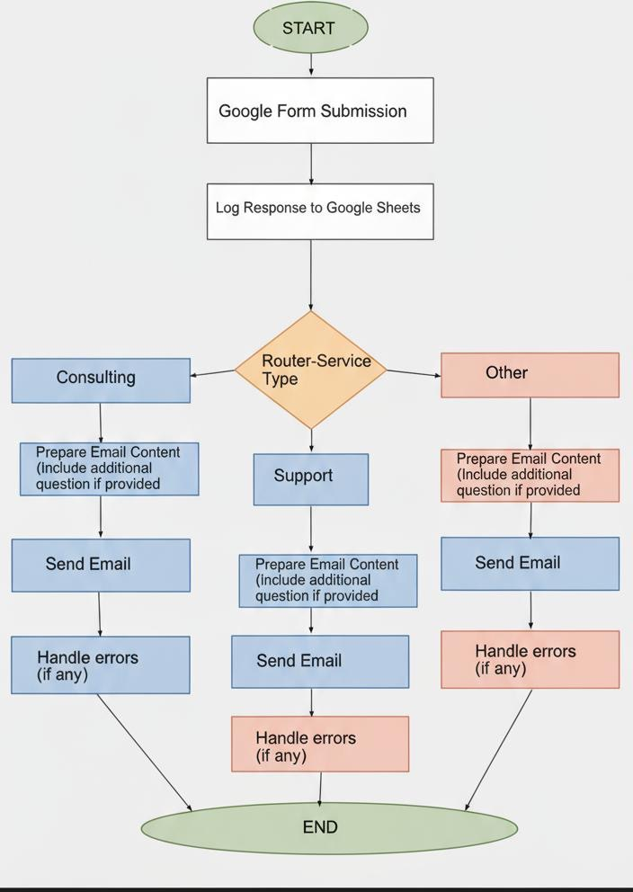
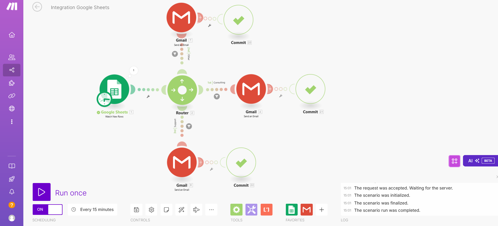

# Client Onboarding Automation

A fully automated client onboarding workflow built with Make.com, seamlessly integrating Google Forms, Google Sheets, and Gmail to deliver a smooth, efficient onboarding experience.

  

-----

## 📖 Overview

This project streamlines the client onboarding process by automating data collection, record management, and personalized email communication.

- **Google Forms** captures new client details such as name, email, service type, and additional inputs
- **Google Sheets** stores the responses for centralized tracking and future reference
- **Gmail** automatically sends tailored welcome emails based on the client’s chosen service

With this setup, onboarding becomes faster, more consistent, and less error-prone—ensuring every client receives the right message at the right time.

-----

## ⚙️ Tools Used

1. **Google Forms** – Collect client information and service requests
1. **Google Sheets** – Maintain an organized record of form responses
1. **Gmail** – Deliver personalized onboarding emails automatically
1. **Make.com** – The automation platform that ties everything together

-----

## ✨ Key Features

- **Automated Data Capture** – Gather client information instantly with Google Forms
- **Personalized Email Delivery** – Dynamic email templates ensure clients receive the right onboarding steps
- **Centralized Record Keeping** – Every submission is logged in Google Sheets for easy management and reporting

-----

## 🚀 How to Set Up

### Prerequisites

- Google account with access to Forms, Sheets, and Gmail
- Make.com account
- Basic understanding of automation workflows

### Setup Steps

1. **Create a Google Form** to collect client details and service selections
1. **Connect the Form to Google Sheets** to automatically record responses
1. **Build the Make.com Scenario**:
- Watch for new form responses
- Save responses into Google Sheets
- Trigger a Gmail automation to send tailored welcome emails
1. **Test Your Workflow** by submitting a form entry to confirm that the correct email is sent

### Configuration Details

#### Google Forms Setup

- Include fields for client name, email, service type, and any additional required information
- Configure form settings to collect email addresses and limit responses if needed

#### Google Sheets Integration

- Ensure the sheet has appropriate column headers matching form fields
- Set up data validation and formatting as needed

#### Gmail Automation

- Create email templates for different service types
- Use dynamic content based on form responses
- Include relevant onboarding materials and next steps

-----

## 📜 License

This project is licensed under the MIT License. See the [LICENSE](LICENSE) file for more details.
